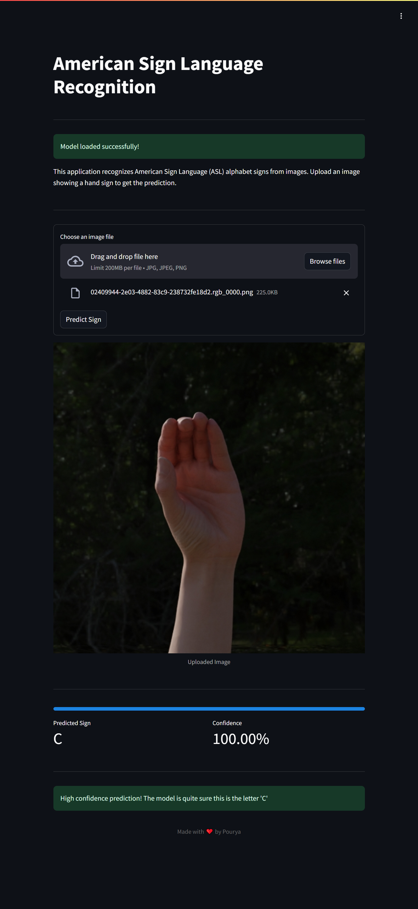

# 🤖 American Sign Language Detection



## 🎯 Project Overview

Welcome to the American Sign Language (ASL) Detection project! This is an interactive web application that implements a Convolutional Neural Network (CNN) to recognize ASL alphabet signs from images. Built with Streamlit and TensorFlow, this application provides an intuitive way to detect and interpret ASL signs, making sign language recognition accessible and engaging.

### ✨ Key Features

1. **🖼️ Real-time Sign Detection**
   - Upload image functionality
   - Instant sign recognition
   - Confidence score display
   - Clear visual feedback

2. **🎛️ Advanced Model Integration**
   - Custom CNN architecture
   - Mixed precision training
   - GPU acceleration support
   - TensorFlow optimization

3. **🎨 User Experience**
   - Clean, single-column layout
   - Progress indicators
   - Intuitive controls
   - Responsive design

## 📋 Table of Contents

1. [Features](#features)
2. [Technical Details](#technical-details)
3. [Installation](#installation)
4. [Deployment Options](#deployment-options)
5. [File Structure](#file-structure)
6. [Usage](#usage)
7. [License](#license)

## 🌟 Features

### Detection Interface
- Clean, modern design
- Real-time processing feedback
- Confidence metrics display
- Clear visual results presentation

### Model Capabilities
- 27 ASL signs recognition (A-Z + blank)
- High accuracy predictions
- Confidence score calculation
- Robust image preprocessing

### System Features
- GPU acceleration (when available)
- Efficient memory management
- Comprehensive error handling
- Image preprocessing pipeline

## 🔧 Technical Details

### Model Architecture
- Framework: TensorFlow 2.x
- Architecture: Custom CNN
- Interface: Streamlit
- Runtime: Python 3.8+

### Optimizations
- Mixed precision training
- XLA compilation
- Batched processing
- TFRecord data pipeline

## 📥 Installation

### Prerequisites
- Python 3.8 or higher
- CUDA-capable GPU (optional, for faster inference)
- Git

### Local Setup
```bash
# Clone the repository
git clone https://github.com/pouryare/american-sign-language-detection.git
cd american-sign-language-detection/app

# Create virtual environment
python -m venv venv

# Activate virtual environment
# On Windows:
venv\Scripts\activate
# On Unix or MacOS:
source venv/bin/activate

# Install dependencies
pip install -r requirements.txt

# Run the application
streamlit run app.py
```

## 🚀 Deployment Options

### 1. 🐋 Docker Deployment

#### Option A: Pull Pre-built Image
```bash
docker pull pouryare/american-sign-language-detection:latest
docker run -p 8501:8501 pouryare/american-sign-language-detection:latest
```

#### Option B: Build Locally
```bash
cd app
docker build -t american-sign-language-detection:latest .
docker run -p 8501:8501 american-sign-language-detection:latest
```

### 2. ☁️ Heroku Deployment
```bash
# Login to Heroku
heroku login

# Create new app
heroku create asl-detection-app

# Add buildpacks
heroku buildpacks:add --index 1 heroku/python
heroku buildpacks:add --index 2 https://github.com/heroku/heroku-buildpack-apt

# Deploy
git push heroku main
```

### 3. 🌐 AWS EC2 Deployment
```bash
# Connect to EC2 instance
ssh -i your-key.pem ec2-user@your-instance-ip

# Update system and install dependencies
sudo yum update -y
sudo yum install git python3 python3-pip -y

# Clone and setup
git clone https://github.com/pouryare/american-sign-language-detection.git
cd american-sign-language-detection/app
pip3 install -r requirements.txt
streamlit run app.py
```

### 4. 🌍 Google Cloud Platform Deployment
```bash
# Initialize Google Cloud
gcloud init

# Create app
gcloud app create

# Deploy
gcloud app deploy app.yaml

# Open in browser
gcloud app browse
```

### 5. 💎 Microsoft Azure Deployment
```bash
# Create web app
az webapp create --resource-group myResourceGroup \
                 --plan myAppServicePlan \
                 --name asl-detection \
                 --runtime "PYTHON|3.8"

# Configure deployment
az webapp deployment source config \
    --name asl-detection \
    --resource-group myResourceGroup \
    --repo-url https://github.com/pouryare/american-sign-language-detection.git \
    --branch main \
    --manual-integration
```

## 📁 File Structure

| File/Directory | Description |
|---------------|-------------|
| 📂 **app/** | Main application directory |
| &nbsp;&nbsp;&nbsp;&nbsp;📜 `app.py` | Main Streamlit application |
| &nbsp;&nbsp;&nbsp;&nbsp;📜 `app.yaml` | Google Cloud configuration |
| &nbsp;&nbsp;&nbsp;&nbsp;📜 `asl_model.keras` | Trained model file |
| &nbsp;&nbsp;&nbsp;&nbsp;📜 `Dockerfile` | Docker configuration |
| &nbsp;&nbsp;&nbsp;&nbsp;📜 `Procfile` | Heroku configuration |
| &nbsp;&nbsp;&nbsp;&nbsp;📜 `requirements.txt` | Python dependencies |
| &nbsp;&nbsp;&nbsp;&nbsp;📜 `setup.py` | Package setup |
| &nbsp;&nbsp;&nbsp;&nbsp;📜 `setup.sh` | Setup script |
| 📜 `.gitattributes` | Git attributes |
| 📜 `.gitignore` | Git ignore rules |
| 📓 `American_Sign_Language_Detection.ipynb` | Training notebook |
| 📜 `LICENSE` | License file |
| 🖼️ `screenshot.png` | Application screenshot |

## 💻 Usage

1. Access the application through your preferred deployment method
2. Upload an image containing an ASL sign
3. Click "Predict Sign" to process the image
4. View the prediction results and confidence score
5. Check additional feedback based on confidence levels

## 🔍 Dataset

This project uses the [Synthetic ASL Alphabet Dataset](https://www.kaggle.com/datasets/lexset/synthetic-asl-alphabet) from Kaggle. The dataset contains high-quality synthetic images of ASL alphabet signs, providing a robust training set for the model.

## 📄 License

This project is licensed under the MIT License. See the [LICENSE](LICENSE) file for details.

## 🙏 Acknowledgements

- The Kaggle community for the ASL dataset
- TensorFlow team for the deep learning framework
- Streamlit team for the web application framework
- All contributors and users of this project

## 👥 Contributing

Contributions are welcome! Please feel free to submit a Pull Request.

1. Fork the repository
2. Create your feature branch (`git checkout -b feature/AmazingFeature`)
3. Commit your changes (`git commit -m 'Add some AmazingFeature'`)
4. Push to the branch (`git push origin feature/AmazingFeature`)
5. Open a Pull Request

## 📬 Contact & Support

For questions and support:
- 📧 Create an issue
- ⭐ Star the repository
- 🔄 Fork for your own use

---

Made with ❤️ by [Pouryare](https://github.com/pouryare)